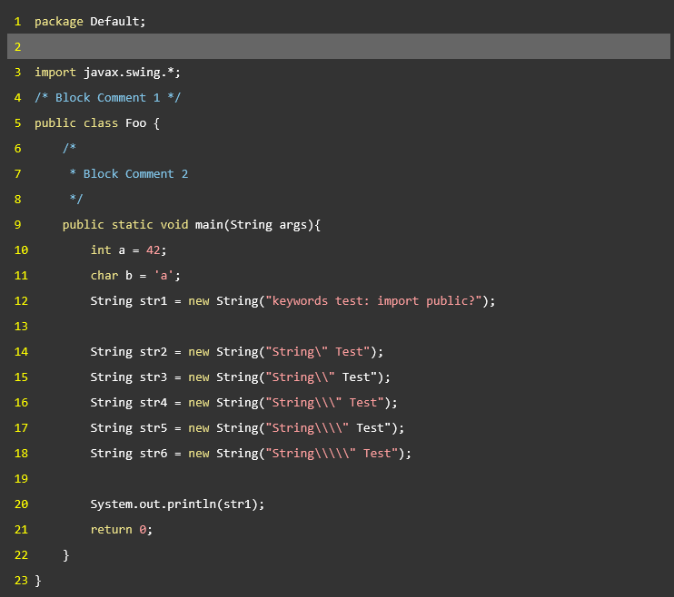
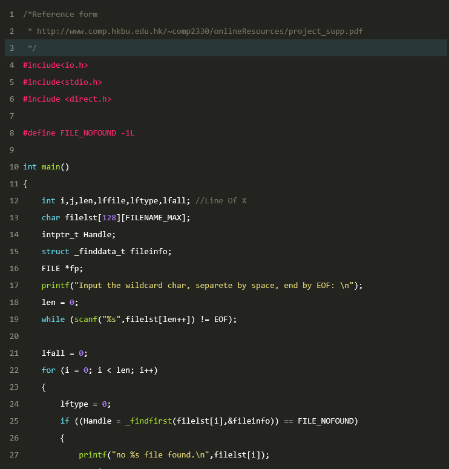

Highlighter.Java
===================
一个简单的代码着色器, 支持命令行与图形界面操作.

###支持的参数
* -h 显示帮助后退出
* -l 为代码加上行号
* -e 增强功能
* -d 打印调试信息
* -o [FILENAME] 输出文件
* -s [FILENAME] 输入文件
* -t [LANGUAGE] 指定代码类型
* -c [THEME] 指定配色方案

###使用
```
java -jar cli.jar -sjava.java -ojava.html 
```

###支持的语言
* ASM
* C/C++
* Java
* Python
* Haskell

###支持的配色
* default
* desert
* molokai

###扩展性
所有的配置方案储存在`/etc`目录下
####语言
Highlighter.java的语言高亮方案储存在`*.lang`文件中.<br>
对于每个lang文件, 每一行的语法是

> 变量名=正则表达式 color=颜色 

表达式中不允许有空格, 所有的正则都要考虑转义, color部分是可选的.
你不需要对以下的内置变量提供完整的正则, 也不需要为他们指定color属性:
*  lineComment 行注释, 你只需要提供行注释的标示, 比如对于表达式`//.*`, 你只需要写`//`
*  blkCommentL blkCommentR 提供用`|`分隔的块注释的左右标示符, 如`<!-->|<-->`
*  macro 宏 提供标示, 在C语言中是`#`
*  String 提供了默认实现, 以""为标志
*  character 提供了默认实现 以''为标志
*  keywords 语言的关键字, 你需要列出所有以`|`分隔的关键字
*  number 提供了默认实现 数字
*  function 提供了默认实现, 匹配诸如`func()`的字串

你可以在实现这些以上这些变量后自由撰写你的高亮方案, 比如:
```
type=\\b(int|double|short|long)\\b color=red
```

高亮了代码中所有你指定的type, 颜色为红色, 你也可以通过`color=keywords`使type与关键字的颜色相同.
另, 自定义变量的优先级低于内置变量.

####配色
Highlighter.java的语言配色方案储存在`*.css`文件中.<br>
[什么是CSS?](http://www.w3school.com.cn/css/)
在配色方案中, 一种变量的属性由与它同名的类选择器实现, 如果你对CSS的语法有一点点了解,
那么更改配色是非常简单的事情.

###开发环境
* Intellij IDEA 14.0.2 + JDK 1.8
* 依赖[Apache Common CLI library](http://commons.apache.org/proper/commons-cli/)

###效果



###参与者:
* LastAvengers
* quweik
* Mus
